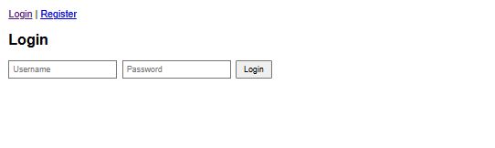
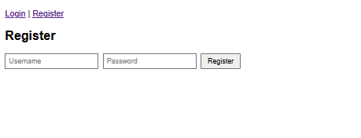
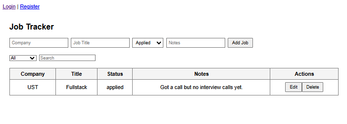
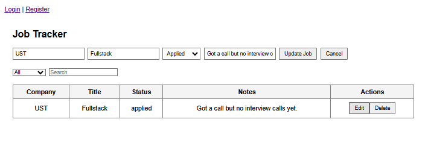

# 🧭 Job Tracker App

A full-stack web application to manage and track your job applications.  
Built using **Django REST Framework** (backend) and **React** (frontend).

---

## 🚀 Features

### 🔹 Core
- User authentication (Register/Login) with **JWT**
- Add, edit, delete job entries
- Track job status (Applied, Interview, Offer, Rejected)
- Notes for each job
- Search and filter by status
- Responsive, clean UI

---

## 🧱 Tech Stack

| Layer | Technology |
|-------|-------------|
| Backend | Django, Django REST Framework, PostgreSQL |
| Auth | JWT (SimpleJWT) |
| Frontend | React, Axios, React Router |
| Deployment | Render (Backend), Vercel (Frontend) |

---

## ⚙️ Installation & Setup

### 1️⃣ Backend (Django)
```bash
# Clone repository
git clone https://github.com/Pro7Prabhakar/job-tracker.git
cd job-tracker

# Create virtual environment
python -m venv venv
source venv/bin/activate   # On Windows: venv\Scripts\activate

# Install dependencies
pip install -r requirements.txt

# Migrate & create superuser
python manage.py migrate
python manage.py createsuperuser

# Run server
python manage.py runserver
```

Backend should now be running on:
🔗 http://localhost:8000/api

### 2️⃣ Frontend (React)
```bash
cd frontend
npm install
npm start
```

Frontend should now be running on:
🔗 http://localhost:5173 (Vite) or http://localhost:3000 (CRA)

## 🔑 Environment Variables
`.env` (Backend)

```
SECRET_KEY=your_django_secret_key
DEBUG=True
DATABASE_NAME=your_db_name
DATABASE_USER=your_db_user
DATABASE_PASSWORD=your_db_password
DATABASE_HOST=localhost
DATABASE_PORT=5432
```

`.env` (Frontend)

REACT_APP_API_URL=http://localhost:8000/api

## 🧪 API Endpoints

| Method | Endpoint         | Description       |
| ------ | ---------------- | ----------------- |
| POST   | `/api/register/` | Register new user |
| POST   | `/api/token/`    | Obtain JWT token  |
| GET    | `/api/jobs/`     | List all jobs     |
| POST   | `/api/jobs/`     | Create new job    |
| PUT    | `/api/jobs/:id/` | Update job        |
| DELETE | `/api/jobs/:id/` | Delete job        |

## 🌍 Deployment

- **Backend (Django)** → [https://render.com]
- **Frontend (React)** → [(https://vercel.com)]

Before deployment, make sure to:

1. Update CORS_ALLOWED_ORIGINS in Django settings.
2. Use your Render backend URL in frontend .env.

## 📸 Screenshots






## 🧑‍💻 Author
**PRABHASHANKAR MISHRA**

💼 [LinkedIn](https://www.linkedin.com/in/prabhashankar-mishra/) | 🐙 [GitHub](https://github.com/Pro7Prabhakar)

## 🪪 License

This project is open-source under the MIT License.

⭐ If you found this helpful, give it a star on GitHub!


---

## 🏷️ Optional Badges


